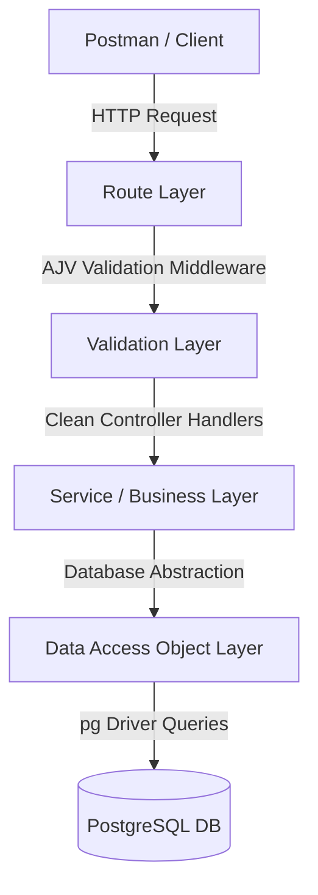
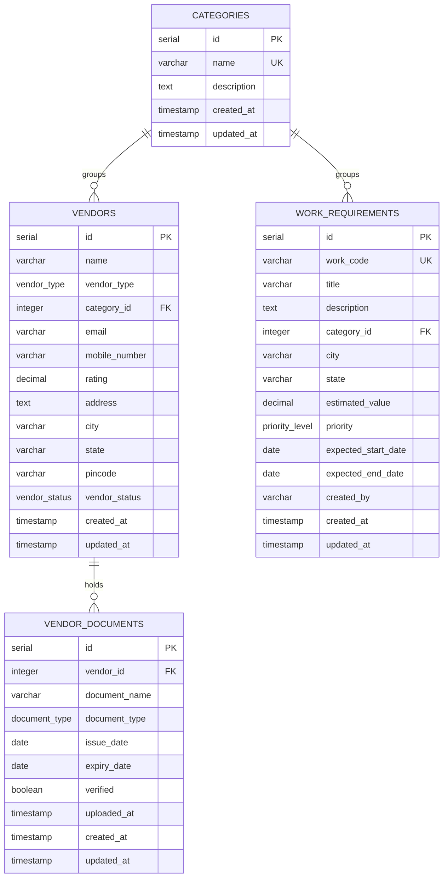

# Vendor Recommendation Platform

An intelligent, rule-based matching engine that ranks active vendors for work requirements based on location matching, performance ratings, and compliance checks.

---

## Project Architecture

This application is built on top of **Node.js** and **Express** using **TypeScript**, following a clean, layered architecture:

### Layer Breakdown
1. **Routing Layer (`src/routes/`)**: Establishes API endpoints (e.g. [/vendors](file:///home/amarjeet/Desktop/vendor-recomendation/src/routes/vendor.routes.ts), [/categories](file:///home/amarjeet/Desktop/vendor-recomendation/src/routes/category.routes.ts), [/vendor-documents](file:///home/amarjeet/Desktop/vendor-recomendation/src/routes/vendor-document.routes.ts), [/work-requirements](file:///home/amarjeet/Desktop/vendor-recomendation/src/routes/work-requirement.routes.ts)).
2. **Schema Validation Layer (`src/schemavalidation/`)**: Validates incoming request payloads using **AJV** (Another JSON Schema Validator) schemas and middlewares defined in [jsonschemavalidators.ts](file:///home/amarjeet/Desktop/vendor-recomendation/src/schemavalidation/jsonschemavalidators.ts).
3. **Service Layer (`src/services/`)**: Implements application-level rules and recommendation business logic (e.g. [work-requirementservice.ts](file:///home/amarjeet/Desktop/vendor-recomendation/src/services/work-requirementservice.ts)).
4. **Data Access Object Layer (`src/dbhelper/`)**: Performs raw SQL interactions with Postgres using parameterized queries via the `pg` pool driver.
5. **Database Migration Layer (`migrations/`)**: Manages the Postgres schema using `node-pg-migrate` to ensure schema updates are applied trackably and reliably.

---

## Database Design

The database schema consists of custom PostgreSQL Enum types and four primary tables linked through relational constraints:

### PostgreSQL Custom Types (Enums)
* **`vendor_type`**: `INDIVIDUAL`, `CONSULTANT`, `CONTRACTOR`, `SUPPLIER`, `SERVICE_PROVIDER`, `MANUFACTURER`, `DISTRIBUTOR`
* **`document_type`**: `TAX_REGISTRATION`, `INSURANCE`, `TRADE_LICENSE`, `SAFETY_CERTIFICATE`, `AGREEMENT`
* **`vendor_status`**: `ACTIVE`, `INACTIVE`, `SUSPENDED`
* **`priority_level`**: `LOW`, `MEDIUM`, `HIGH`, `CRITICAL`

---

## API Design

All endpoints follow RESTful standards and return standard JSON formats:

### Vendors Endpoints
* `POST /vendors` - Register a new vendor (validated by `createVendorSchema`)
* `POST /vendors/query` - List vendors with filters in the body (validated by `queryVendorSchema`)
* `GET /vendors/:id` - Fetch details for a specific vendor
* `PUT /vendors/:id` - Update vendor fields (validated by `updateVendorSchema`)
* `DELETE /vendors/:id` - Delete a vendor record

### Work Requirements Endpoints
* `POST /work-requirements` - Register a new work requirement
* `POST /work-requirements/query` - List/filter work requirements
* `GET /work-requirements/:id` - Fetch details for a requirement
* `PUT /work-requirements/:id` - Update a requirement
* `DELETE /work-requirements/:id` - Delete a requirement
* `GET /work-requirements/:id/recommend` - **Match engine:** Recommends valid active vendors ranked by evaluation scores.

---

## Recommendation Logic

The recommendation engine in [recommendVendors](file:///home/amarjeet/Desktop/vendor-recomendation/src/services/work-requirementservice.ts) evaluates candidates using a multi-step filter-and-score algorithm:

### Step 1: Candidate Filtering
The system filters the candidate pool using:
* **Category Match**: The vendor's `category_id` must match the work requirement's `category_id`.
* **Vendor Status**: Only vendors whose `vendor_status` is `'ACTIVE'` are considered.

### Step 2: Strict Compliance Evaluation (Pass/Fail)
Every candidate's uploaded documentation in `vendor_documents` is evaluated against these strict rules:
* **Document Missing**: A vendor must have at least one document uploaded. If `0` documents exist, they are **rejected**.
* **Document Verification**: Every document must be verified (`verified = true`). If any document is unverified, the vendor is **rejected**.
* **Document Expiry**: The document's `expiry_date` must be valid and not in the past relative to the current timestamp. If any document is expired, the vendor is **rejected**.

### Step 3: Scoring Matrix (Out of 100 Points)

| Criteria | Max Points | Formula / Evaluation |
| :--- | :---: | :--- |
| **Performance Rating** | **40** | `(rating / 5) * 40` (Rating ranges from 0 to 5) |
| **Location Matching** | **30** | `30` points for exact City match (case-insensitive) `15` points for State match (if city does not match) `0` points otherwise |
| **Compliance Credentials** | **30** | `30` points awarded automatically if they pass all Step 2 verification checks |

### Step 4: Sorting & Ranking
All accepted vendors are sorted by their aggregated total scores in descending order. Rankings are assigned sequentially beginning at `Rank 1`.

---

## AI Usage

In order to simplify the decision-making process for procurers, the engine programmatically simulates an AI reasoning layer to generate natural-language insights:

* **AI-generated Recommendation Summary**: Summarizes why the Rank 1 vendor is recommended (incorporating their score, performance rating, and geographic proximity).
* **Vendor Risk Summary**: Categorizes candidate risk levels (`LOW` or `MEDIUM`) based on customer feedback scores and location matchups (e.g. flagging out-of-city travel as coordination overhead).
* **Compliance Observations**: Provides visibility into verification logs (e.g. "All 3 documents are active and verified").
* **Vendor Comparison Summary**: Compares the top candidates dynamically to explain why the leading vendor got selected over the runners-up.

---

## Assumptions

1. **Category Mapping**: A vendor can only be assigned to a single category (via `category_id` in the `vendors` table).
2. **Mandatory Documentation**: If a vendor is registered, they must hold at least one valid compliance document. A vendor with no files is considered a high compliance risk and ignored.
3. **Rating Scale**: The vendor's performance rating is scaled from `0.0` to `5.0`.
4. **Active Status default**: New vendors default to an `'ACTIVE'` status unless specified otherwise.

---

## Trade-offs

1. **Database-level Joins vs. In-memory Iterations**: 
   * *Trade-off*: We fetch candidate lists and then query their documents iteratively inside a loop.
   * *Consequence*: Easy to read and implement using standard DAOs, but could trigger an `N+1` query issue if the number of active vendors in a single category is large. In production, this should be refactored to use a single SQL `JOIN` query fetching all candidates and their documents in one trip.
2. **Rule rigidity**: 
   * *Trade-off*: An unverified or expired trade license rejects the vendor completely.
   * *Consequence*: Keeps the platform 100% compliant, but prevents hiring a highly-rated vendor who might be in the middle of renewing an auxiliary document.
